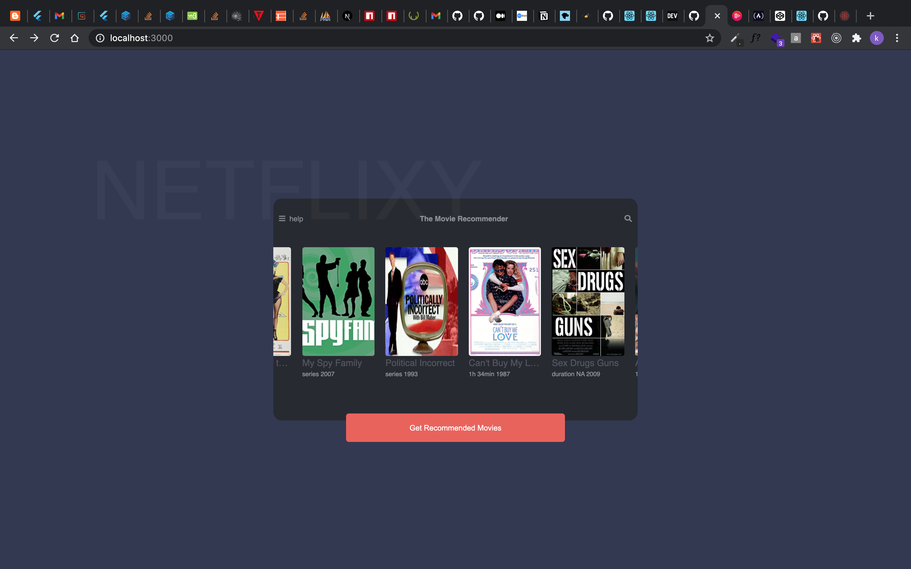

# Advanced Redux

Open [https://sleez007.github.io/Netflixy-App/](https://sleez007.github.io/Netflixy-App/) to view it in the browser.

This codebase focuses on redux middlewares and also how to use store enhancers. Libraries like styled components, redux-logger, redux-persist, react-redux were used in this project.

